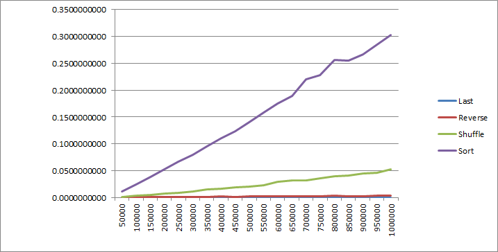

# Algorithmic Complexity

This repo details my workings through the Algorithmic Complexity material from the Makers Academy course (https://github.com/makersacademy/course/tree/master/algorithmic_complexity)

## Timing

The first section involves timing how long the following Ruby methods take to run:

- last
- reverse
- shuffle
- sort

I did this by using ```Benchmark``` in Ruby, running the methods against an array populated with random numbers between 1 and 9. The code can be found in the 'code-timer.rb' file.

I then moved onto testing each of these methods on different length arrays, ranging from 50000 to 100000. The code can be viewed in the files named with the respective methods in the lib folder. This provides a picture of how the length of time to run the method is impacted by the length of the array.

The image below shows this represented in a line graph. The vertical axis shows the time taken to run the method in seconds and the horizontal axis the length of the array used.


